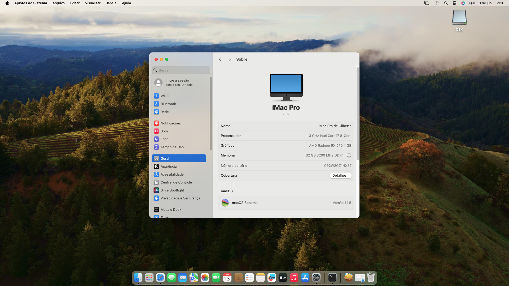
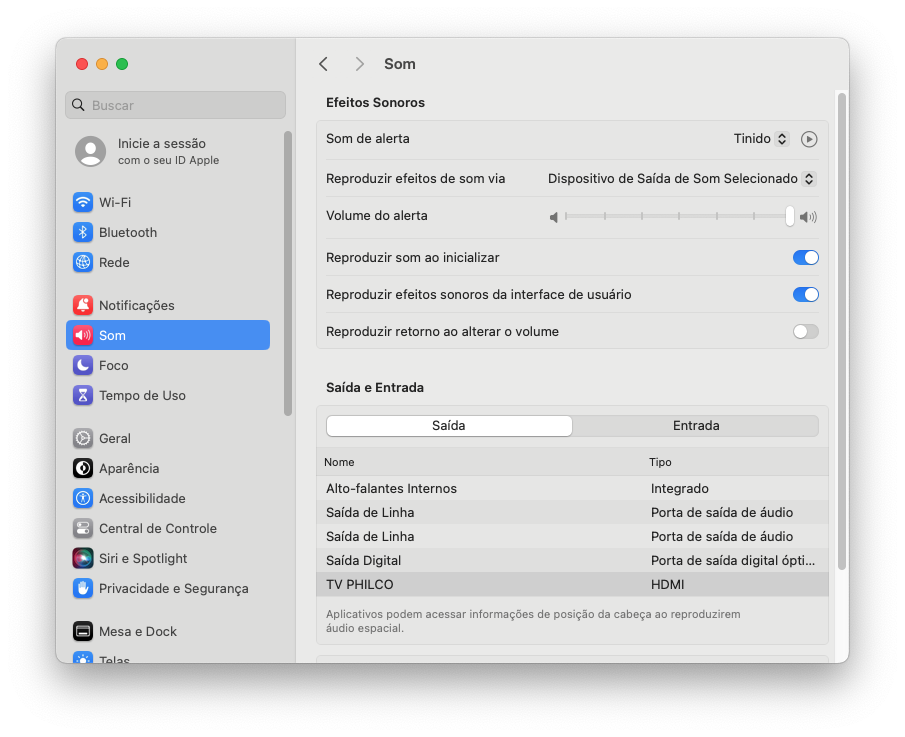
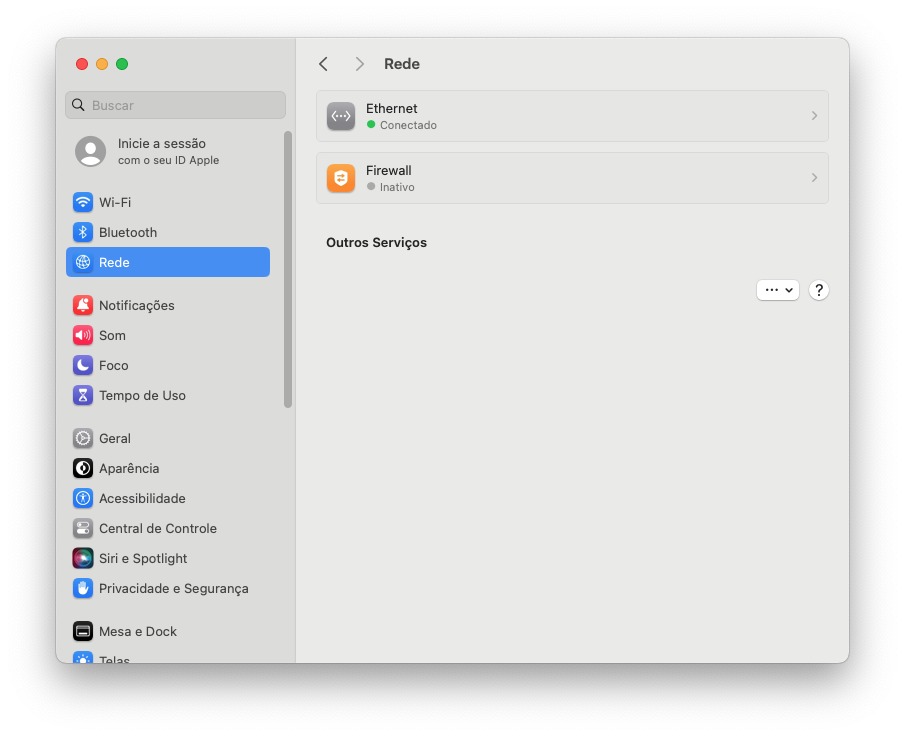
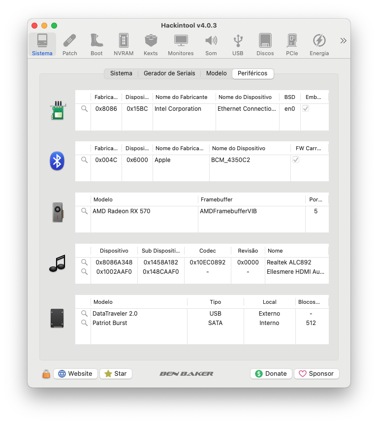
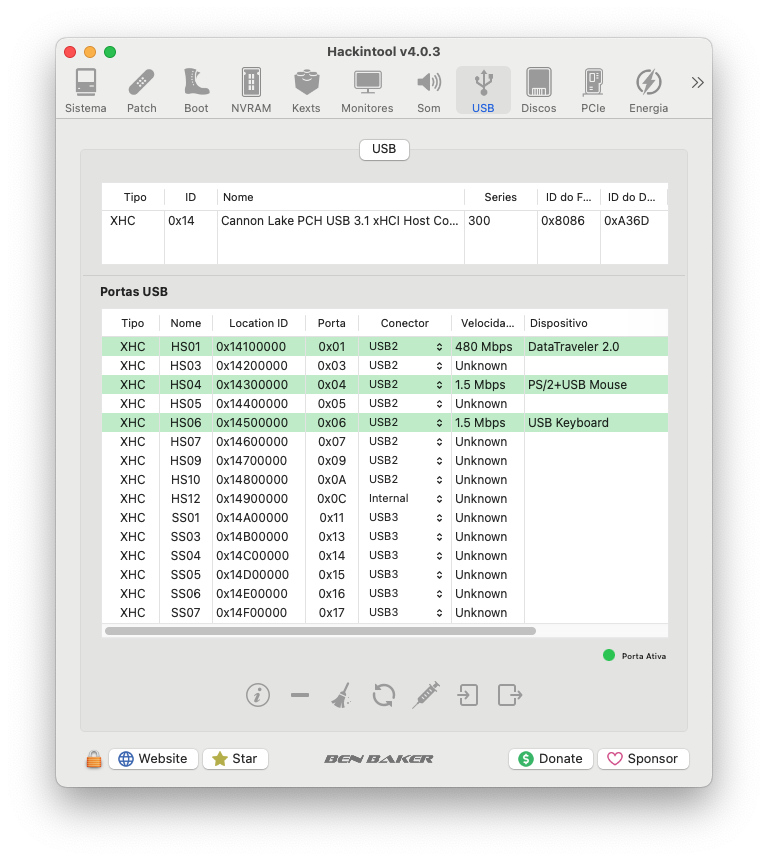

[Português Brasileiro](https://github.com/Gilberto-Mascena/Z390M-GAMING/blob/main/README-pt_br.md) | [English](https://github.com/Gilberto-Mascena/Z390M-GAMING/blob/main/README.md)

# *EFI OC Gigabyte Z390M GAMING*

##

## *Sistemas operacionais*

  
   
   
    
    
  
  

  

---

_**Minha configuração**_

- _**Placa-mãe**_
    - <a href="https://www.gigabyte.com/br/Motherboard/Z390-M-GAMING-rev-10#kf" alt="photo Z390 M GAMING" target="_blank">*Gigabyte Z390M GAMING*</a>
- _**Versão da Bios**_
  - *F10*
- _**Gabinete**_
  - *Pixxo Cg01 Rgb*
- _**Fonte**_
  - *GIGABYTE - GP-P550*
- _**CPU**_
  - *Core I7 9700F*
- _**Water Cooler**_
  - *DEEPCOOL GAMMAXX L120T*
- _**NVME M.2**_
  - *XPG GAMMIX S11L 256GB / macOS*
- _**NVME M.2**_
  - *XPG GAMMIX S41 512GB / Windows 11*
- _**GPU**_
  - *RADEON RX 570 4GB RED DRAGON PowerColor*

> [!NOTE]
> *Para obter mais informações sobre GPUs compatíveis com macOS, consulte: [Native amd gpus](https://dortania.github.io/GPU-Buyers-Guide/modern-gpus/amd-gpu.html#native-amd-gpus)*

##

- _**Memória**_
  - *Crucial Ballistix 4x8GB 16GB*
- _**WI-FI**_
  - *BCM94360CD chip Apple*

> [!NOTE]
> *Para obter mais informações sobre placas Wi-Fi compatíveis com macOS, consulte: [Supported/Unsupported Chipsets](https://dortania.github.io/Wireless-Buyers-Guide/unsupported.html#supported-chipsets)*

##

- _**Rede**_
  - *Intel I219-V*

---

## _Navegação por tópicos_
- [*O que funciona*](#ancora1)
- [*Resultados do Geekbench*](#ancora2)
- [*Capturas de telas*](#ancora3)
- [*Kexts usados, (todas releases)*](#ancora4)
- [*Ferramentas recomendadas*](#ancora5)
- [*Configurações de BIOS Intel*](#ancora6)
- [*Agradecimentos*](#ancora7)
- [*Licença* ](#ancora8)

<h2>O que funciona 👀</h2>

- [x] *Audio*
- [x] *Rede*
- [x] *WI-FI*
- [x] *Bluetooth*
- [x] *USB*
- [x] *Sleep*

[Voltar](#ancora)

<h2>Resultados do Geekbench 👀</h2>

- [*Windows 11 Pro*](https://browser.geekbench.com/v5/cpu/19703206)
- [*macOS Ventura 13.1*](https://browser.geekbench.com/v5/cpu/19703520)
- [*macOS Sonoma 14.0 Beta 1*](https://browser.geekbench.com/v6/cpu/1566485)
- [*Ubuntu 22.04.2 LTS*](https://browser.geekbench.com/v6/cpu/1953890)

[Voltar](#ancora)

## Capturas de telas

<h2>Audio 👀</h2>

<h2>Rede 👀</h2>

<h2>Periféricos 👀</h2>

<h2>Audio Hackintool 👀</h2>

<h2>Mapeamento de portas USB 👀</h2>

<h2>kexts 👀</h2>

[Voltar](#ancora)

<h2>Kexts usados, (todas releases) 👀</h2>

- *[`WhateverGreen.kext`](https://github.com/acidanthera/WhateverGreen)*
- *[`Lilu.kext`](https://github.com/acidanthera/Lilu)*
- *[`VirtualSMC`](https://github.com/acidanthera/VirtualSMC), somente: `VirtualSMC.kext`, `SMCProcessor.kext` e `SMCSuperIO.kext`*.
- *[`IntelMausi.kext`](https://github.com/acidanthera/IntelMausi)*
- *[`CpuTscSync.kext`](https://github.com/acidanthera/CpuTscSync)*
- *[`AppleALC.kext`](https://github.com/acidanthera/AppleALC)*
- *`USBMap.kext`*

[Voltar](#ancora)

<h2>Ferramentas recomendadas 👀</h2>

* _**Recomendação 1**_
  * *Use [`GenSMBIOS`](https://github.com/corpnewt/GenSMBIOS), para gerar novos seriais para seu SMBIOS a fim de evitar conflitos com iServices*
* _**Recomendação 2**_
  * *Use [`ProperTree`](https://github.com/corpnewt/ProperTree), para editar seu config.plist*    
* _**Recomendação 3**_
  * *Use [`USBMap`](https://github.com/corpnewt/USBMap), para mapear suas portas USB, a partir do OC 0.9.3, elas podem ser mapeadas com XHCIPortLimit habilitado em config.plist + [`USBInjectAll`](https://github.com/Sniki/OS-X-USB-Inject-All/releases)*
* _**Recomendação 4**_
  * *Extraia seu DSDT do Windows*
  * *Use [`SSDTTime`](https://github.com/corpnewt/SSDTTime), para gerar seus patches SSDT*   
* _**Recomendação 5**_
  * *Use [`MaciASL`](https://github.com/acidanthera/MaciASL), para compilar seus patches SSDT no mac*

[Voltar](#ancora)

<h2>Configurações de BIOS Intel 👀</h2>

- [*OpenCore Install Guide*](https://dortania.github.io/OpenCore-Install-Guide/config.plist/coffee-lake.html#intel-bios-settings)

[Voltar](#ancora)

## 👉 [_Criando o instalador do macOS no Windows ou Linux_](https://github.com/Gilberto-Mascena/How-to-create-a-macOS-installer-without-a-Mac)

## *Agradecimentos*

- [*Acidanthera Team*](https://github.com/acidanthera)
- [*CorpNewt*](https://github.com/corpnewt)
- [*CrisHotpatch*](https://t.me/crishotpatch)
- [*Dortania*](https://dortania.github.io/OpenCore-Install-Guide/config.plist/coffee-lake.html#starting-point)
- [*Dicas do Mateus*](https://www.youtube.com/c/DicasdoMateus)
- [*Gabriel Luchina*](https://www.youtube.com/c/gabrielluchina)
- [*OpenCore Legacy Patcher*](https://github.com/dortania/OpenCore-Legacy-Patcher)
- *E outros*

[Voltar](#ancora)

## *Licença* 

[*Licença MIT*](LICENSE.md) (*MIT*)

### Gilberto | Dev _2020_ 

[Voltar](#ancora)
