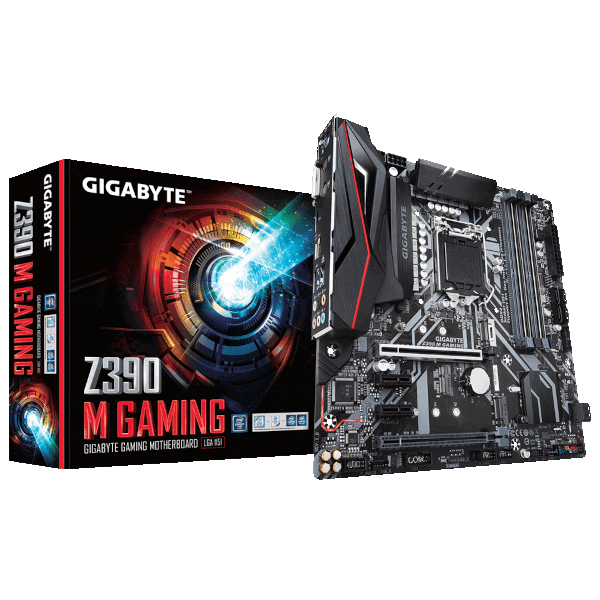
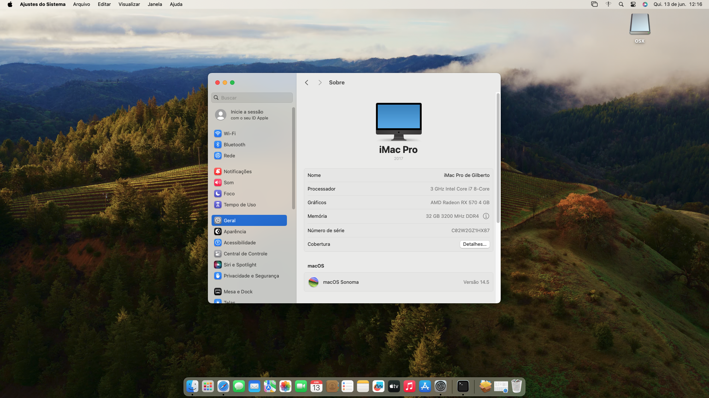
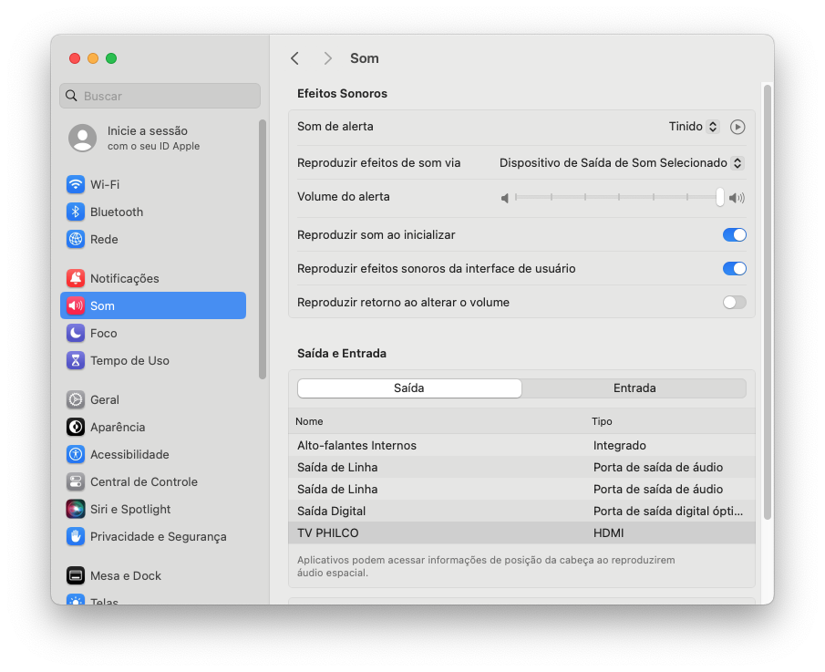
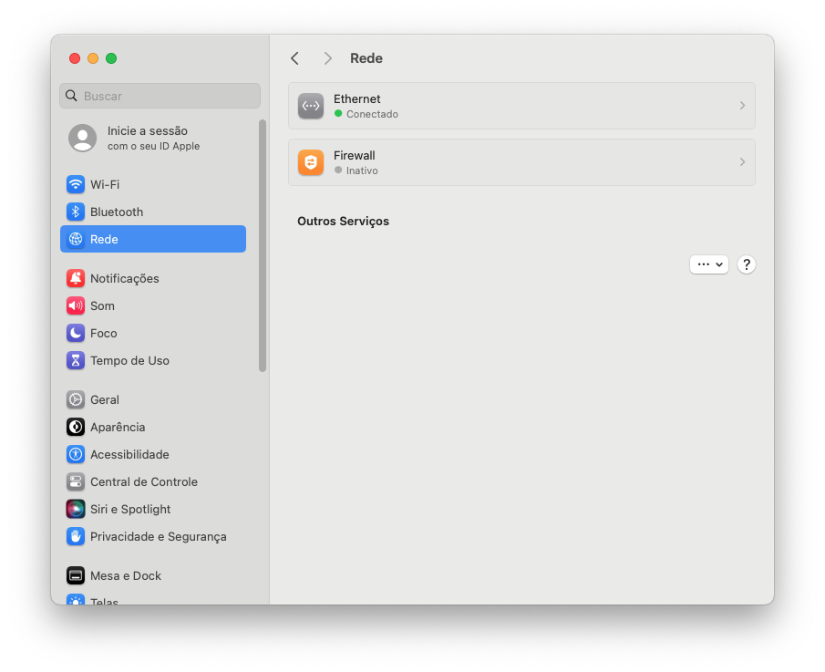
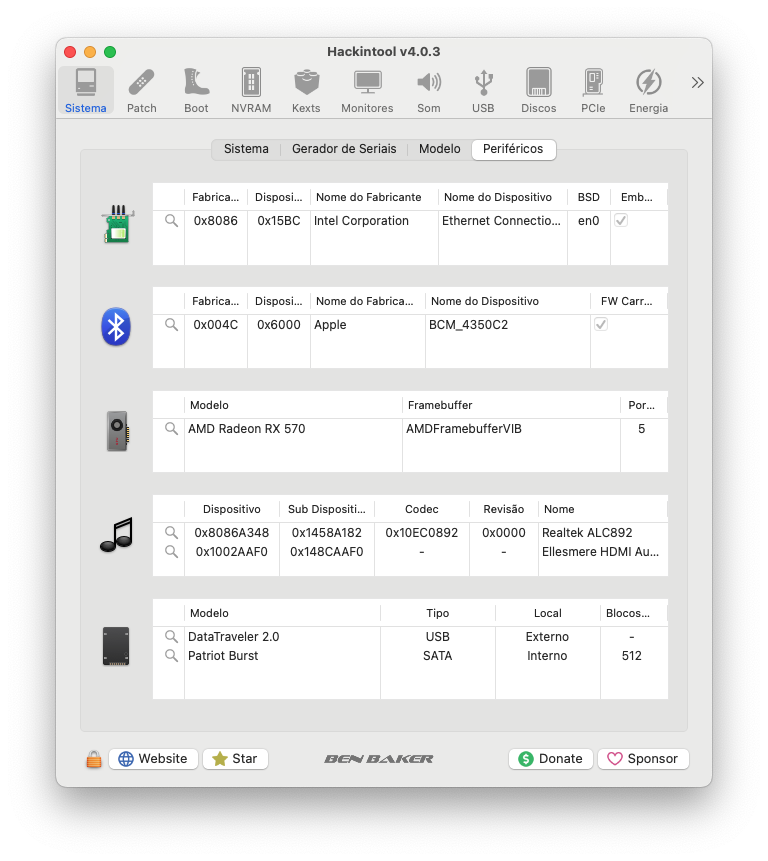
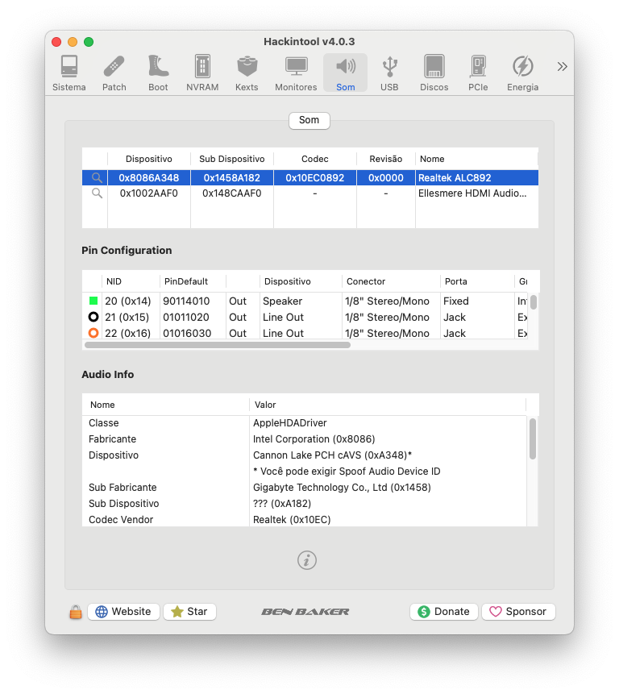
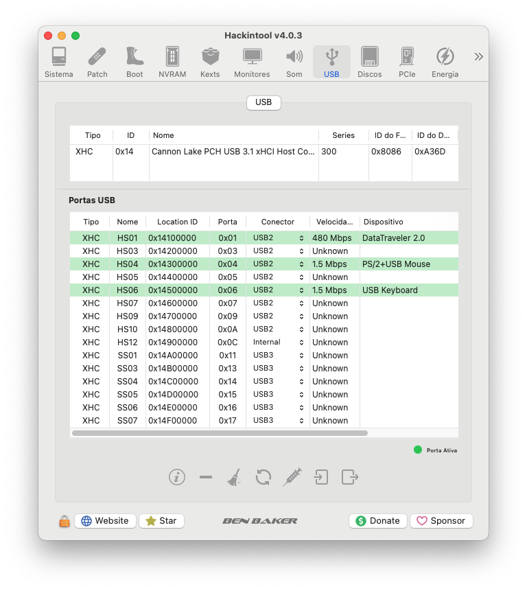
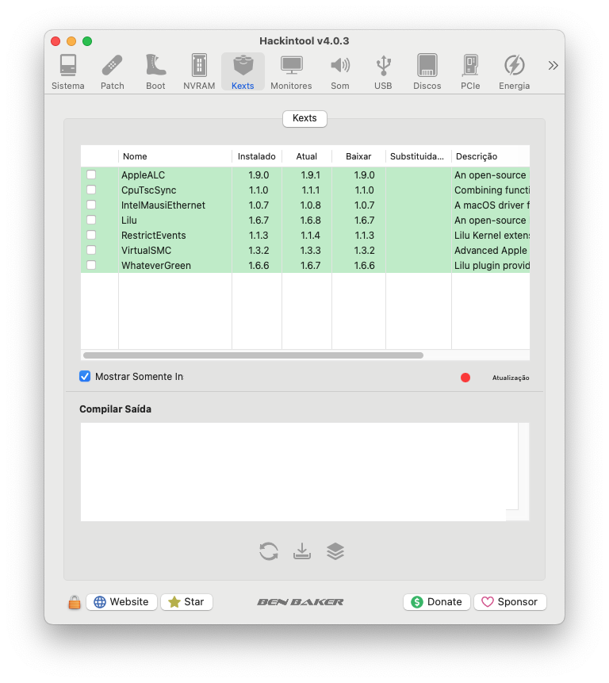

# *EFI OC Gigabyte Z390M GAMING*

##

## *Operational system*

_**macOS**_  _**Sonoma**_

##

_**My Setup**_

##

- _**Motherboard**_
  - <a href="https://www.gigabyte.com/br/Motherboard/Z390-M-GAMING-rev-10#kf" alt="photo Z390 M GAMING" target="_blank">*Gigabyte Z390M GAMING*</a>
- _**Case**_
  - *Pixxo Cg01 Rgb*
- _**Power supply**_
  - *GIGABYTE - GP-P550*
- _**CPU**_
  - *Core I7 9700F*
- _**Water Cooler**_
  - *DEEPCOOL GAMMAXX L120T*
- _**NVME M.2**_
  - *XPG GAMMIX S11L 256GB / macOS*
- _**NVME M.2**_
  - *XPG GAMMIX S41 512GB / Windows 11*
- _**GPU**_
  - *RX 570 4G PowerColor Red Dragon*
- _**Memory**_
  - *Crucial Ballistix 4x8GB 16GB*
- _**WI-FI**_
  - *BCM94360CD chip Apple*
- _**Network**_
  - *Intel I219-V*

---

## Navigation
- [*What works*](#ancora1)
- [*Geekbench results*](#ancora2)
- [*Screenshot*](#ancora3)
- [*Kexts used, (all Releases)*](#ancora4)
- [*Recommended tools*](#ancora5)
- [*Intel BIOS Settings*](#ancora6)
- [*Thanks*](#ancora7)
- [*License* ](#ancora8)

## *What works*

- [x] *Sound*
- [x] *Network*
- [x] *WI-FI*
- [x] *Bluetooth*
- [x] *USB*
- [x] *Sleep*

[Top](#ancora)

---

## *Geekbench results*

- [*Windows 11 Pro*](https://browser.geekbench.com/v5/cpu/19703206)
- [*macOS Ventura 13.1*](https://browser.geekbench.com/v5/cpu/19703520)
- [*macOS Sonoma 14.0 Beta 1*](https://browser.geekbench.com/v6/cpu/1566485)
- [*Ubuntu 22.04.2 LTS*](https://browser.geekbench.com/v6/cpu/1953890)

[Top](#ancora)

---

## *Screenshot*

## *Sound*

## *Ethernet*

## *Peripherals*

## *Sound Peripherals*

## *Hackintool USB port mapping*

## *Hackintool kexts*

[Top](#ancora)

---

## *Kexts used, (all Releases)*

- *[`WhateverGreen.kext`](https://github.com/acidanthera/WhateverGreen)*
- *[`Lilu.kext`](https://github.com/acidanthera/Lilu)*
- *[`VirtualSMC`](https://github.com/acidanthera/VirtualSMC), only: `VirtualSMC.kext`, `SMCProcessor.kext` and `SMCSuperIO.kext`*.
- *[`IntelMausi.kext`](https://github.com/acidanthera/IntelMausi)*
- *[`CpuTscSync.kext`](https://github.com/acidanthera/CpuTscSync)*
- *[`AppleALC.kext`](https://github.com/acidanthera/AppleALC)*
- *`USBMap.kext`*

[Top](#ancora)

---

## *Recommended tools*

* _**Recommendation 1**_
  * *Use [`GenSMBIOS`](https://github.com/corpnewt/GenSMBIOS), to generate new serials for your SMBIOS in order to avoid conflicts with iServices.*
* _**Recommendation 2**_
  * *Use [`ProperTree`](https://github.com/corpnewt/ProperTree), to edit your config.plist.*    
* _**Recommendation 3**_
  * *Use [`USBMap`](https://github.com/corpnewt/USBMap), to map your USB ports, starting from OC 0.9.3, they can be mapped with XHCIPortLimit enabled in config.plist + [`USBInjectAll`](https://github.com/Sniki/OS-X-USB-Inject-All/releases).*
* _**Recommendation 4**_
  * *Extract your DSDT from windows.*
  * *Use [`SSDTTime`](https://github.com/corpnewt/SSDTTime), to generate your SSDT patches.*   
* _**Recommendation 5**_
  * *Use [`MaciASL`](https://github.com/acidanthera/MaciASL), to compile your SSDT patches on mac.*

[Top](#ancora)

---

## *Intel BIOS Settings*

- [*OpenCore Install Guide*](https://dortania.github.io/OpenCore-Install-Guide/config.plist/coffee-lake.html#intel-bios-settings)

[Top](#ancora)

---

## *Thanks*

- [*Acidanthera Team*](https://github.com/acidanthera)
- [*CorpNewt*](https://github.com/corpnewt)
- [*CrisHotpatch*](https://t.me/crishotpatch)
- [*Dortania*](https://dortania.github.io/OpenCore-Install-Guide/config.plist/coffee-lake.html#starting-point)
- [*Dicas do Mateus*](https://www.youtube.com/c/DicasdoMateus)
- [*Gabriel Luchina*](https://www.youtube.com/c/gabrielluchina)
- *And others*

[Top](#ancora)

---

## *License* 

*The* [*MIT License*](LICENSE.md) (*MIT*)

*Copyright :copyright: 2020* 

[Top](#ancora)

---