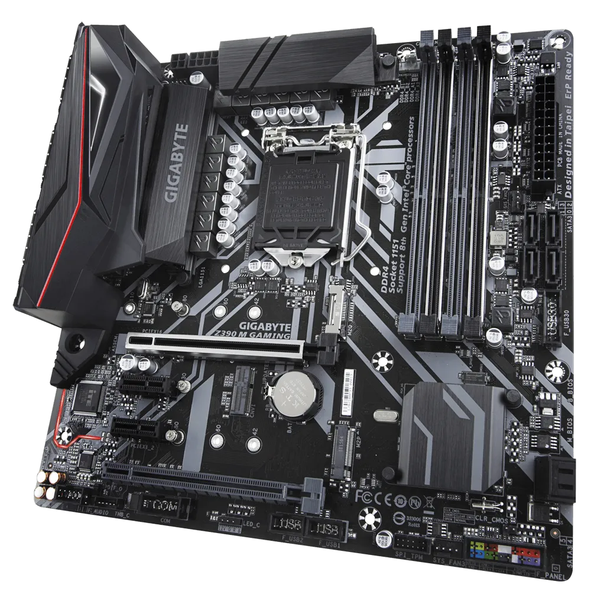

# *EFI OC Z390M GAMING macOS Ventura (Sonoma BETA 1)*

##

## *Sistema Operacional*

*macOS* | *Ventura (Sonoma BETA 1)*
:---:|:---
##

## *Meu Setup*

*Config* | *Desktop*
:---:|:---
Placa Mãe | <a href="https://www.gigabyte.com/br/Motherboard/Z390-M-GAMING-rev-10#kf" target="_blank">*Gigabyte Z390M GAMING*</a>
Gabinete | Fortress-tg Gamemax
Fonte | GIGABYTE - GP-P550
CPU | Core I7 9700F
Water Cooler | DEEPCOOL GAMMAXX L120T
NVME M.2 | XPG GAMMIX S11L 256GB / macOS
NVME M.2 | XPG GAMMIX S41 512GB / Windows 11
GPU | RX 570 4G PowerColor
Memória ram |CORSAIR VENGEANCE 2x16GB total 32GB
WI-FI | BCM94360CD chip Apple
##

## *O que funciona*

- [x] Áudio.
- [x] LAN.
- [x] WI-FI. (não funciona no Sonoma BETA1)
- [x] Bluetooth.
- [x] USB.
- [x] Sleep.
##

## *Resultados Geekbench*

- [*Windows 11 Pro*](https://browser.geekbench.com/v5/cpu/19703206)
- [*macOS Ventura 13.1*](https://browser.geekbench.com/v5/cpu/19703520)
- [*macOS Sonoma 14.0 Beta 1*](https://browser.geekbench.com/v6/cpu/1566485)
- [*Ubuntu 22.04.2 LTS*](https://browser.geekbench.com/v6/cpu/1953890)
##

## *Captura de telas*

##

## *Utilização*

* Recomendação 1
  * *Use [`GenSMBIOS`](https://github.com/corpnewt/GenSMBIOS), para gerar novos seriais para sua SMBIOS afim de evitar conflitos com iServices.*
* Recomendação 2
  * *Use [`ProperTree`](https://github.com/corpnewt/ProperTree), para editar sua config.plist.*     
* Recomendação 3
  * *Use [`USBMap`](https://github.com/corpnewt/USBMap), para mapear suas portas USB, (apartir do OC 0.9.3, pode ser mapeadas com XHCIPortLimit + USBInjectAll).*
* Recomendação 4
  * *Extrair sua DSDT a partir do windows.*
  * *Use [`SSDTTime`](https://github.com/corpnewt/SSDTTime), para gera seus patches de SSDT.*    
* Recomendação 5
  * *Use [`MaciASL`](https://github.com/acidanthera/MaciASL), para compilar seus patches de SSDT.*
##

## *Agradecimentos*

- [*Acidanthera*](https://github.com/acidanthera)
- [*CorpNewt*](https://github.com/corpnewt)
- [*CrisHotpatch*](https://t.me/crishotpatch)
- [*Dortania*](https://dortania.github.io/OpenCore-Install-Guide/config.plist/coffee-lake.html#starting-point)
- [*Dicas do Mateus*](https://www.youtube.com/c/DicasdoMateus)
- [*Gabriel Luchina*](https://www.youtube.com/c/gabrielluchina)
##

## *Licença* 

*The* [*MIT License*](https://github.com/Gilberto-Mascena/Z390M_GAMING/blob/main/LICENSE.md) (*MIT*)

*Copyright :copyright: 2020* 
##