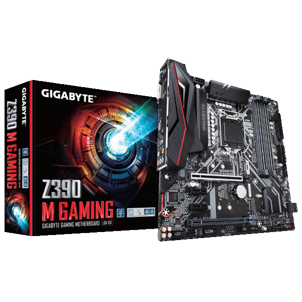
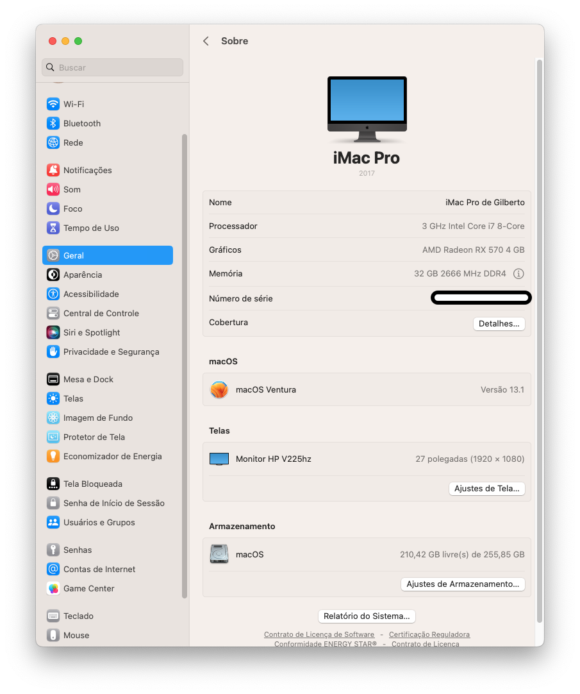
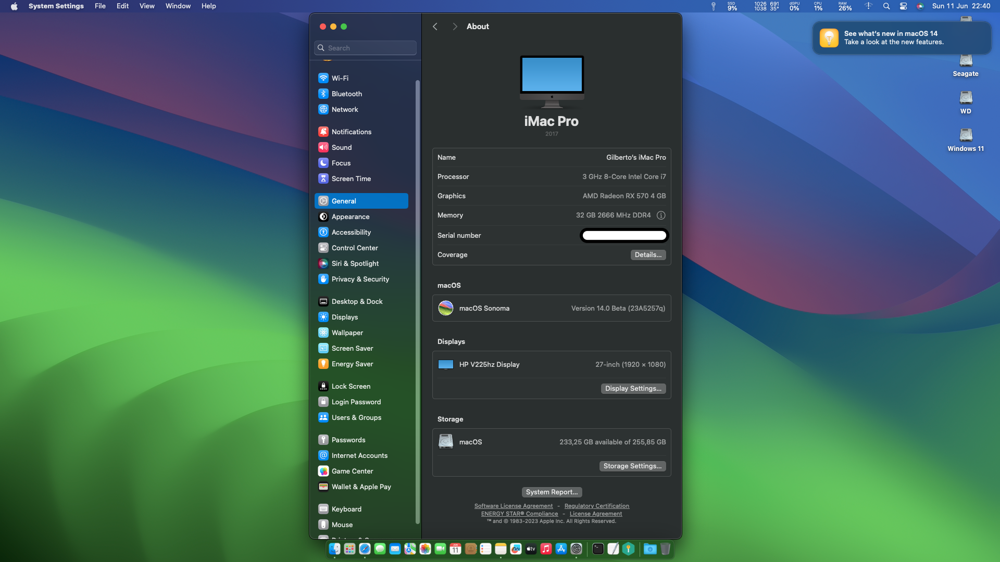
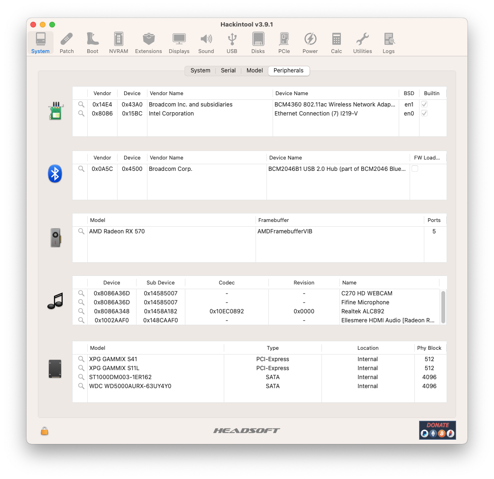
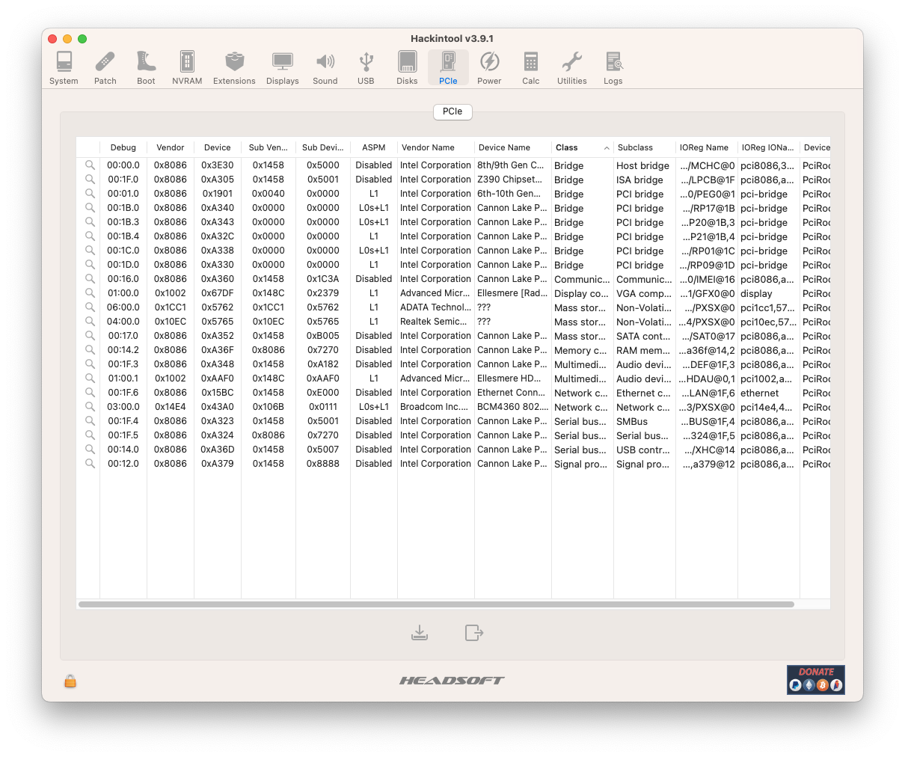
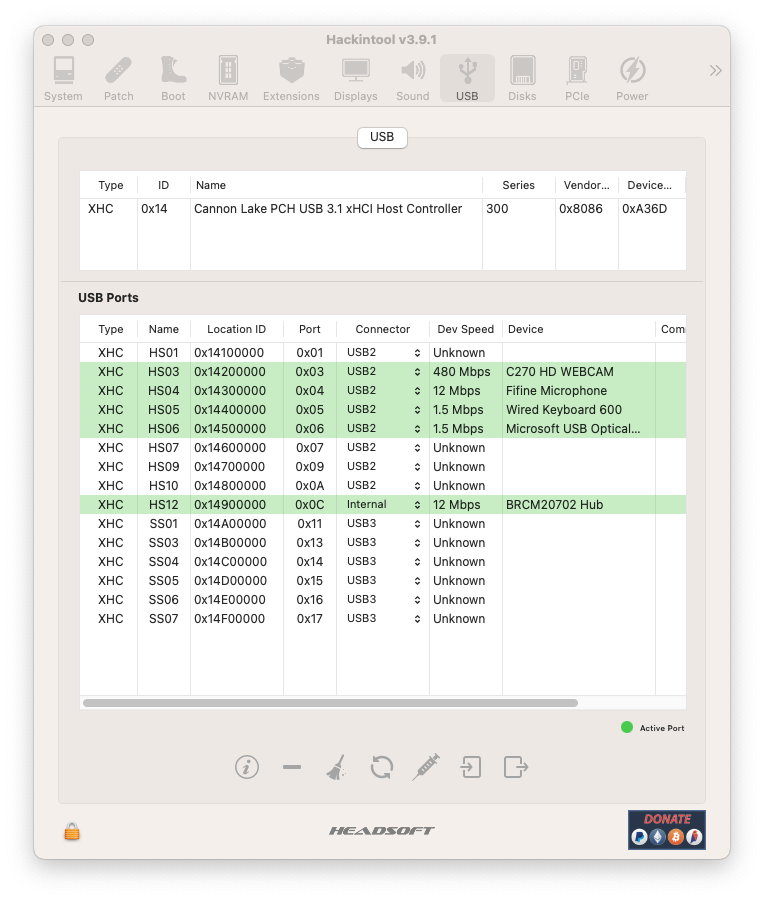
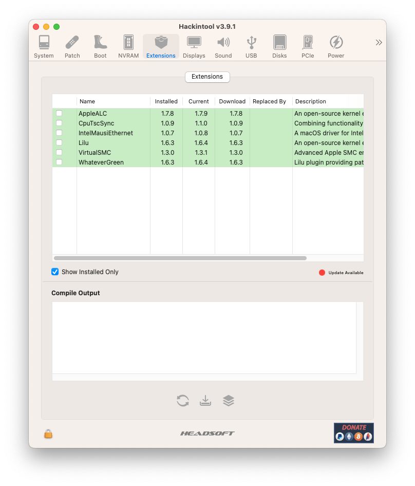

# *EFI OC Z390M GAMING macOS Ventura (Sonoma BETA 1)*

##

## *Sistema Operacional*

_**macOS**_  _**Ventura (Sonoma BETA 1)**_

##

_**Meu Setup**_

##

- _**Placa Mãe**_
  - <a href="https://www.gigabyte.com/br/Motherboard/Z390-M-GAMING-rev-10#kf" target="_blank">*Gigabyte Z390M GAMING*</a>
- _**Gabinete**_
  - *Fortress-tg Gamemax*
- _**Fonte**_
  - *GIGABYTE - GP-P550*
- _**CPU**_
  - *Core I7 9700F*
- _**Water Cooler**_
  - *DEEPCOOL GAMMAXX L120T*
- _**NVME M.2**_
  - *XPG GAMMIX S11L 256GB / macOS*
- _**NVME M.2**_
  - *XPG GAMMIX S41 512GB / Windows 11*
- _**GPU**_
  - *RX 570 4G PowerColor*
- _**Memória ram**_
  - *CORSAIR VENGEANCE LPX 2x16GB total 32GB*
- _**WI-FI**_
  - *BCM94360CD chip Apple*
- _**Rede**_
  - *Intel I219-V*
##

## *O que funciona*

- [x] *Áudio.*
- [x] *Rede.*
- [x] *WI-FI.*
- [x] *Bluetooth.*
- [x] *USB.*
- [x] *Sleep.*
##

## *Resultados Geekbench*

- [*Windows 11 Pro*](https://browser.geekbench.com/v5/cpu/19703206)
- [*macOS Ventura 13.1*](https://browser.geekbench.com/v5/cpu/19703520)
- [*macOS Sonoma 14.0 Beta 1*](https://browser.geekbench.com/v6/cpu/1566485)
- [*Ubuntu 22.04.2 LTS*](https://browser.geekbench.com/v6/cpu/1953890)
##

## *Captura de telas*

##

## *Kexts usadas, (todas versões Releases)*

- *[`WhateverGreen.kext`](https://github.com/acidanthera/WhateverGreen)*
- *[`Lilu.kext`](https://github.com/acidanthera/Lilu)*
- *[`VirtualSMC`](https://github.com/acidanthera/VirtualSMC), somente: `VirtualSMC.kext`, `SMCProcessor.kext` e `SMCSuperIO.kext`*.
- *[`IntelMausi.kext`](https://github.com/acidanthera/IntelMausi)*
- *[`CpuTscSync.kext`](https://github.com/acidanthera/CpuTscSync)*
- *[`AppleALC.kext`](https://github.com/acidanthera/AppleALC)*
- *`USBMap.kext`*
##

## *Utilização*

* _**Recomendação 1**_
  * *Use [`GenSMBIOS`](https://github.com/corpnewt/GenSMBIOS), para gerar novos seriais para sua SMBIOS afim de evitar conflitos com iServices.*
* _**Recomendação 2**_
  * *Use [`ProperTree`](https://github.com/corpnewt/ProperTree), para editar seu config.plist.*     
* _**Recomendação 3**_
  * *Use [`USBMap`](https://github.com/corpnewt/USBMap), para mapear suas portas USB, apartir do OC 0.9.3, pode ser mapeadas com XHCIPortLimit habilitada no config.plist + [`USBInjectAll`](https://github.com/Sniki/OS-X-USB-Inject-All/releases).*
* _**Recomendação 4**_
  * *Extrair sua DSDT a partir do windows.*
  * *Use [`SSDTTime`](https://github.com/corpnewt/SSDTTime), para gera seus patches de SSDT.*    
* _**Recomendação 5**_
  * *Use [`MaciASL`](https://github.com/acidanthera/MaciASL), para compilar seus patches de SSDT.*
##

## *Configurações de BIOS Intel*

* _**Desativar**_

  * *Fast Boot*
  * *Secure Boot*
  * *Serial/COM Port*
  * *Parallel Port*
  * *VT-d (pode ser ativado se você definir DisableIoMapper como true)*
  * *Módulo de suporte de compatibilidade (CSM) (deve estar desativado na maioria dos casos, erros/paradas de GPU como gIO são comuns quando esta opção está ativada)*
  * *Thunderbolt (para instalação inicial, pois o Thunderbolt pode causar problemas se não for configurado corretamente)*
  * *Intel SGX*
  * *Intel Platform Trust*
  * *CFG Lock (proteção contra gravação MSR 0xE2) (deve estar desativado, se você não conseguir encontrar a opção, ative AppleXcpmCfgLock em Kernel -> Quirks. Seu hack não inicializará com o CFG-Lock ativado)*

* _**Habilitar**_

  * *VT-x*
  * *Above 4G Decoding (Resizable BAR -> Disable)*
  * *Hyper-Threading*
  * *Execute Disable Bit*
  * *EHCI/XHCI Hand-off*
  * *Tipo de SO: Modo UEFI do Windows 8.1/10 (algumas placas-mãe podem exigir "Outro sistema operacional")*
  * *DVMT pré-alocado (memória iGPU): 64 MB ou superior*
  * *Modo SATA: AHCI*
##

## *Agradecimentos*

- [*Acidanthera Team*](https://github.com/acidanthera)
- [*CorpNewt*](https://github.com/corpnewt)
- [*CrisHotpatch*](https://t.me/crishotpatch)
- [*Dortania*](https://dortania.github.io/OpenCore-Install-Guide/config.plist/coffee-lake.html#starting-point)
- [*Dicas do Mateus*](https://www.youtube.com/c/DicasdoMateus)
- [*Gabriel Luchina*](https://www.youtube.com/c/gabrielluchina)
- *E outros*
##

## *Licença* 

*The* [*MIT License*](LICENSE.md) (*MIT*)

*Copyright :copyright: 2020* 
##